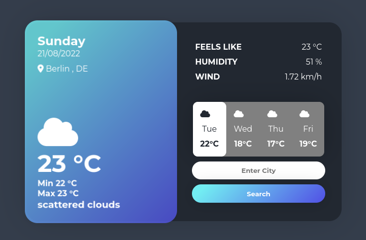

#### Weather

Weather app built using FastAPI,  [OpenWeather](https://openweathermap.org/) API & [Font Awesome Icons](https://fontawesome.com/)



###### Required Libraries

```
pip install -r requirements.txt
```

or

```
pip install fastapi
pip install uvicorn
pip install requests
pip install Jinja2
```

#### Setup

1. Get API Key from [OpenWeather](https://openweathermap.org/api)

2. Add API Key to app:
   
   - Create new py file api_key.py with a simple return method
     
     ```
     def get_api_key():
         return "api_key"
     ```
     
     or
   
   - Edit the API key directly inside the main.py
     
     ```
     API_KEY = "api_key"
     ```

3. Get [FontAwesome Kit](https://fontawesome.com/start) to use the icons:
   
   - Add FontAwesome Kit to templates/index.html
     
     Change {fontawesome-kit} with your kit
     
     ```
     <script src="https://kit.fontawesome.com/{fontawesome-kit}.js" crossorigin="anonymous"></script>
     ```

4. Run the app
   
   ```
   uvicorn main:app --reload
   ```


#### Credits

Weather template [Html,CSS] by Colin Espinas [Codepen](https://codepen.io/Call_in/pen/pMYGbZ)


